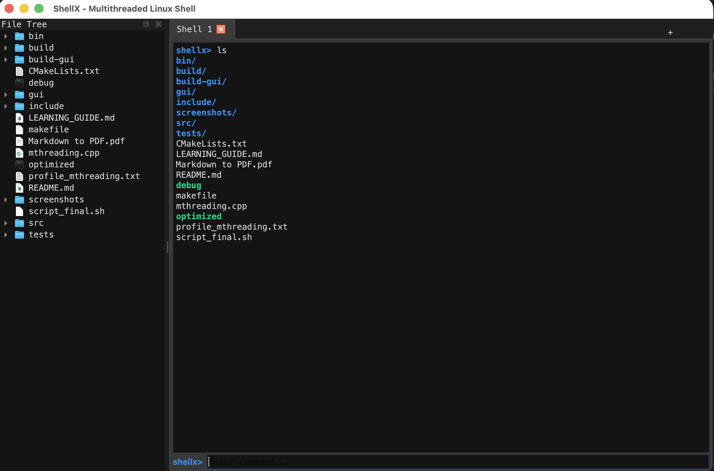
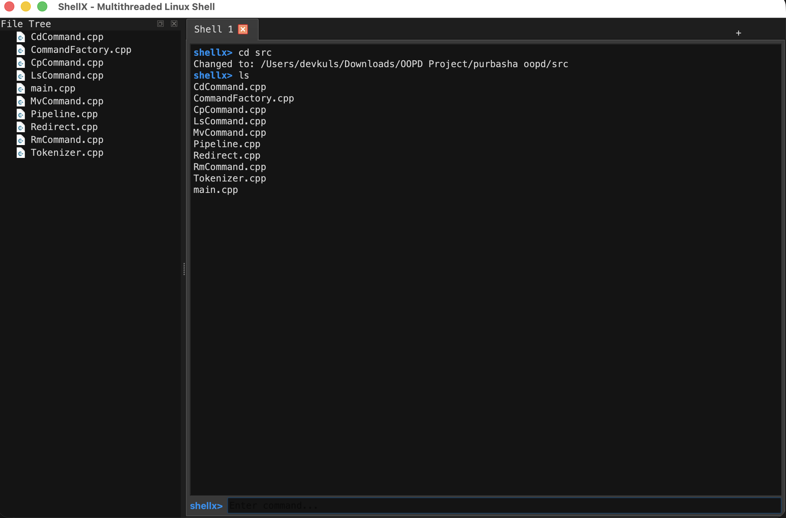
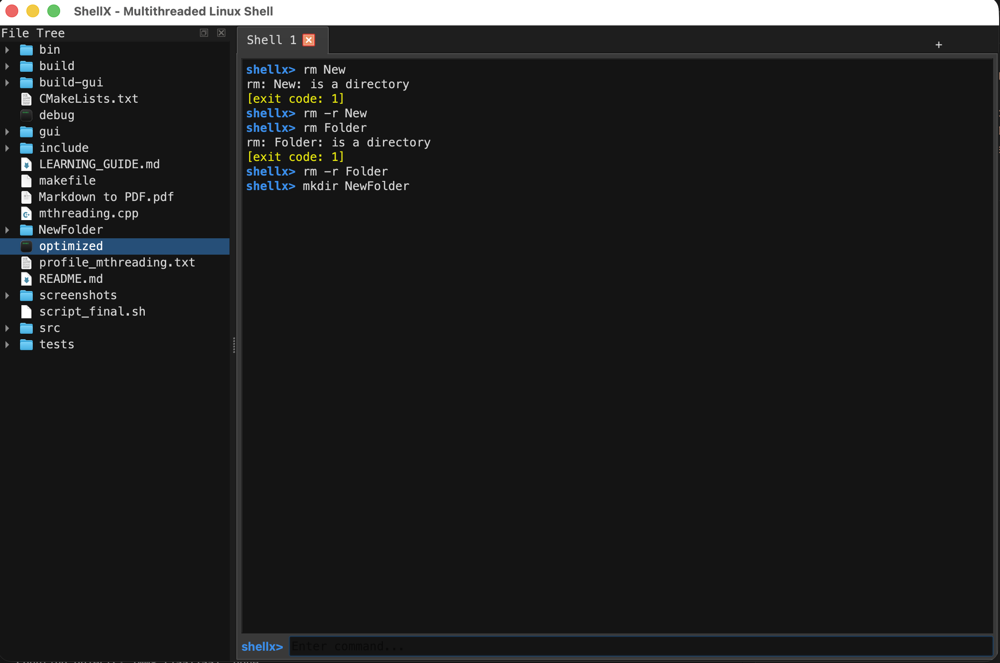
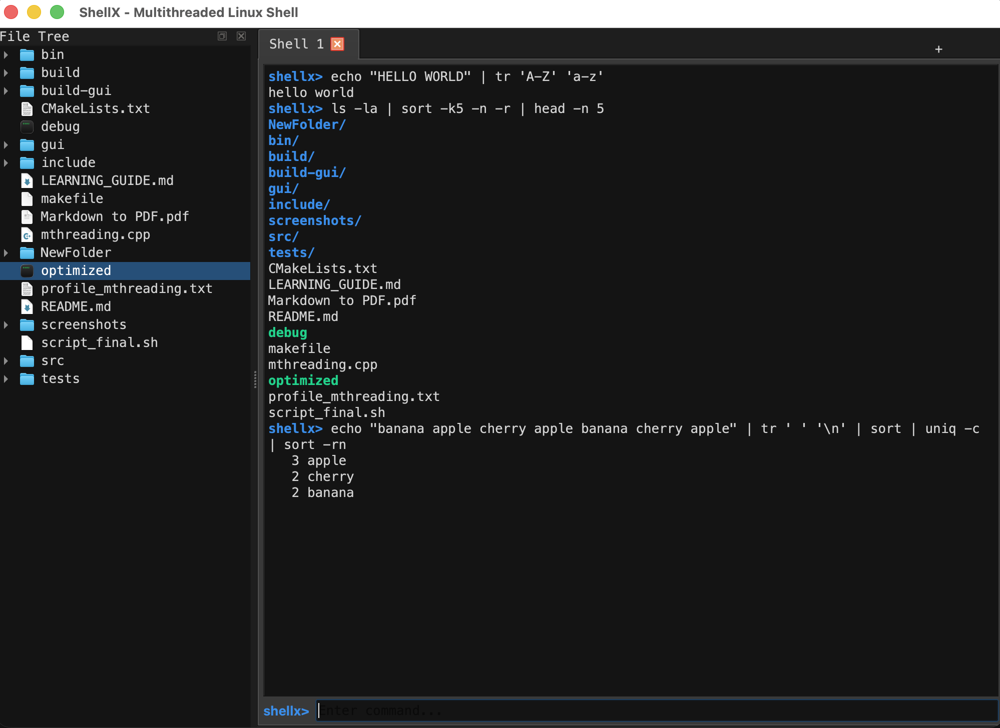

# ShellX — Multithreaded Linux Shell

A **multi-threaded Linux shell** and **Qt6 GUI diagnostic tool** built from scratch in **C++17** using **POSIX APIs**. Supports built-in commands, external program execution, pipelines, I/O redirection, syntax highlighting, and a full desktop GUI frontend — all sharing a single core library.

Built as a portfolio project demonstrating proficiency in **systems programming**, **multi-threading**, **multi-process execution**, **IPC**, **Qt GUI development**, and **modern C++ practices**.

---

## Demo

### GUI — Built-in Commands

#### `ls` — Directory Listing


#### `cd` — Change Directory (file tree auto-updates)


#### `rm` & `mkdir` — File Operations


### GUI — Pipes & Multi-Process IPC


> Add more screenshots to the `screenshots/` folder and reference them here.

---

## Features

### Shell Core
- **Built-in commands** — `ls`, `cd`, `mv`, `cp`, `rm`, `pwd`, `mkdir` with flag support (`-r`, `-f`, `-v`, `--help`)
- **External command execution** — any program in `$PATH` via `fork()` + `execvp()`
- **Pipelines** — chain commands with `|` (e.g., `ls | sort | head -n 5`)
- **I/O Redirection** — `<` (stdin), `>` (stdout), `>>` (append)
- **Multithreaded file operations** — parallel `cp`, `mv`, `rm` using `std::async` and `std::future`
- **Robust tokenizer** — handles quoted strings (`"hello world"`), escape characters (`\ `), nested quotes
- **RAII memory safety** — `std::unique_ptr` for command lifecycle, no manual `new`/`delete`

### Qt6 GUI Frontend
- **Tabbed terminal sessions** — multiple independent shells in one window
- **Live file tree** — side panel auto-navigates on `cd`
- **Syntax highlighting** — green (built-in), blue (external), red (unknown) as you type
- **ANSI color rendering** — colored output from `ls --color`, `grep --color`, etc.
- **Command palette** — `Ctrl+Shift+P` with fuzzy search over commands, history, and files
- **Search-in-scrollback** — `Ctrl+F` to find text in output history
- **Dark/Light theme** — toggle with `Ctrl+Shift+T`
- **Dockable file tree** — drag to any edge or float as separate window

### Build & Debug
- **Dual build systems** — Makefile and CMake
- **Debug builds** — AddressSanitizer + UndefinedBehaviorSanitizer enabled
- **Smoke tests** — automated tests for built-ins, pipes, redirects, external commands
- **Unit tests** — tokenizer parsing validation with 15+ test cases
- **Auto-dependency tracking** — header changes trigger minimal recompilation

---

## Tech Stack

| Category | Technologies |
|:---|:---|
| **Language** | C++17 |
| **OS / APIs** | Linux, POSIX (`fork`, `execvp`, `pipe`, `dup2`, `waitpid`) |
| **Threading** | `std::thread`, `std::async`, `std::future`, `std::promise`, `std::mutex` |
| **GUI Framework** | Qt6 (Widgets, QProcess, QFileSystemModel, QSyntaxHighlighter) |
| **Build Systems** | CMake 3.16+, GNU Make |
| **Debugging** | AddressSanitizer, UndefinedBehaviorSanitizer, Valgrind, gdb, gprof |
| **Testing** | Custom unit test harness, smoke test automation |
| **Version Control** | Git |
| **Design Patterns** | Command Pattern, Factory Pattern, RAII, Polymorphism |

---

## Project Structure

```
shellx/
├── include/                    # Header files (public interface)
│   ├── Command.h               #   Abstract base class (Command pattern)
│   ├── CdCommand.h             #   cd — change directory
│   ├── LsCommand.h             #   ls — list directory contents
│   ├── MvCommand.h             #   mv — move/rename (multithreaded)
│   ├── CpCommand.h             #   cp — copy files (multithreaded)
│   ├── RmCommand.h             #   rm — remove files (multithreaded)
│   ├── CommandFactory.h        #   Factory to instantiate commands
│   ├── Tokenizer.h             #   State-machine tokenizer
│   ├── Pipeline.h              #   Pipe and external command execution
│   └── Redirect.h              #   I/O redirection (<, >, >>)
│
├── src/                        # Core library implementation
│   ├── main.cpp                #   CLI entry point (REPL loop)
│   ├── CdCommand.cpp
│   ├── LsCommand.cpp
│   ├── MvCommand.cpp
│   ├── CpCommand.cpp
│   ├── RmCommand.cpp
│   ├── CommandFactory.cpp
│   ├── Tokenizer.cpp
│   ├── Pipeline.cpp
│   └── Redirect.cpp
│
├── gui/                        # Qt6 GUI frontend
│   ├── main.cpp                #   GUI entry point
│   ├── MainWindow.h/.cpp       #   Main window (tabs, dock, menu)
│   ├── TerminalWidget.h/.cpp   #   Terminal session (output + input)
│   ├── CommandHighlighter.h/.cpp  # Live syntax highlighting
│   ├── CommandPalette.h/.cpp   #   Fuzzy-search command palette
│   └── CMakeLists.txt          #   GUI build config
│
├── tests/                      # Test suite
│   ├── test_tokenizer.cpp      #   Tokenizer unit tests
│   └── CMakeLists.txt          #   Test build config
│
├── screenshots/                # Demo screenshots for README
│   ├── ls.png
│   ├── cd.png
│   ├── rm_mkdir.png
│   └── pipe.png
│
├── CMakeLists.txt              # Root CMake config
├── makefile                    # GNU Make config (CLI only)
├── mthreading.cpp              # Original monolithic source (archived)
├── .gitignore
├── UPGRADE_ROADMAP.md          # Detailed engineering roadmap
├── LEARNING_GUIDE.md           # Step-by-step project walkthrough
└── README.md                   # This file
```

---

## Prerequisites

Before building, make sure you have the following installed:

| Requirement | Minimum Version | Check Command | Install (macOS) |
|:---|:---|:---|:---|
| **C++ Compiler** (g++ or clang++) | C++17 support | `g++ --version` | Comes with Xcode: `xcode-select --install` |
| **GNU Make** | Any | `make --version` | Comes with Xcode |
| **CMake** | 3.16+ | `cmake --version` | `brew install cmake` |
| **Qt6** *(GUI only)* | 6.x | `qmake6 --version` | `brew install qt` |
| **Git** | Any | `git --version` | `brew install git` |

### Platform Support

| Platform | CLI | GUI |
|:---|:---:|:---:|
| macOS (Apple Silicon / Intel) | Yes | Yes |
| Linux (Ubuntu 20.04+) | Yes | Yes |
| Windows (WSL2) | Yes | Requires X server |

> **Linux users:** Install Qt6 with `sudo apt install qt6-base-dev qt6-base-dev-tools`

---

## Getting Started

### 1. Clone the Repository

```bash
git clone https://github.com/purbashabarik/multithreaded-linux-shell.git
cd multithreaded-linux-shell
```

### 2. Build the CLI (Quick Start — Makefile)

The fastest way to build and run the shell:

```bash
# Build the release version
make release

# Run the shell
./bin/shellx
```

Other Makefile targets:

```bash
make debug       # Build with AddressSanitizer + UBSan
make test        # Run smoke tests (built-ins, pipes, redirects)
make test-unit   # Run tokenizer unit tests
make clean       # Remove all build artifacts
```

### 3. Build Everything with CMake (CLI + GUI)

```bash
# Create and enter build directory
mkdir -p build-cmake && cd build-cmake

# Configure (auto-detects Qt6 for GUI)
cmake .. -DCMAKE_PREFIX_PATH=$(brew --prefix qt)

# Compile using all CPU cores
make -j$(sysctl -n hw.ncpu)        # macOS
# make -j$(nproc)                  # Linux
```

This builds three targets:
| Target | Description | Location |
|:---|:---|:---|
| `shellx_core` | Static library (shared command logic) | `build-cmake/libshellx_core.a` |
| `shellx` | CLI shell executable | `build-cmake/shellx` |
| `shellx-gui` | Qt6 GUI application | `build-cmake/gui/shellx-gui.app` (macOS) |

### 4. Run the CLI

```bash
./shellx              # from build-cmake/
# or
./bin/shellx           # from project root (Makefile build)
```

### 5. Run the GUI

```bash
# macOS
open build-cmake/gui/shellx-gui.app

# Linux
./build-cmake/gui/shellx-gui
```

---

## Usage

### CLI Mode

```
.........Welcome to ShellX........
shellx> ls
CMakeLists.txt  README.md  gui/  include/  makefile  src/  tests/

shellx> echo hello world
hello world

shellx> ls | sort | head -n 3
CMakeLists.txt
README.md
gui

shellx> echo "hello" > /tmp/test.txt
shellx> cat /tmp/test.txt
hello

shellx> exit
```

### GUI Keyboard Shortcuts

| Shortcut | Action |
|:---|:---|
| `Enter` | Execute command |
| `Up / Down` | Navigate command history |
| `Ctrl+T` | New tab |
| `Ctrl+W` | Close tab |
| `Ctrl+F` | Search in scrollback |
| `Ctrl+Shift+P` | Command palette |
| `Ctrl+Shift+T` | Toggle dark/light theme |
| `Ctrl+Q` | Quit application |

### Supported Commands

| Command | Example | Description |
|:---|:---|:---|
| `ls` | `ls -la` | List directory contents |
| `cd` | `cd ~/Documents` | Change directory |
| `pwd` | `pwd` | Print working directory |
| `cp` | `cp -r src/ backup/` | Copy files (multithreaded) |
| `mv` | `mv old.txt new.txt` | Move/rename files (multithreaded) |
| `rm` | `rm -rf build/` | Remove files (multithreaded) |
| `mkdir` | `mkdir new_folder` | Create directory |
| `echo` | `echo "hello"` | Print text |
| *Any external* | `git status` | Runs via `fork` + `execvp` |
| Pipes | `ls \| grep ".cpp"` | Chain commands |
| Redirect | `echo hi > file.txt` | Output to file |

---

## Architecture

```
┌─────────────────────────────────────────────────────────┐
│                      Frontends                          │
│  ┌──────────────┐              ┌──────────────────────┐ │
│  │   CLI (REPL) │              │     Qt6 GUI          │ │
│  │  src/main.cpp│              │  gui/MainWindow      │ │
│  │              │              │  gui/TerminalWidget   │ │
│  └──────┬───────┘              │  gui/CommandPalette   │ │
│         │                      │  gui/CommandHighlighter│
│         │                      └──────────┬────────────┘│
│         │                                 │              │
│         └─────────────┬───────────────────┘              │
│                       │                                  │
│              ┌────────▼─────────┐                        │
│              │   shellx_core    │ (static library)       │
│              │  ┌─────────────┐ │                        │
│              │  │  Tokenizer  │ │  Input parsing         │
│              │  ├─────────────┤ │                        │
│              │  │  Pipeline   │ │  fork/exec/pipe/wait   │
│              │  ├─────────────┤ │                        │
│              │  │  Redirect   │ │  I/O redirection       │
│              │  ├─────────────┤ │                        │
│              │  │  Commands   │ │  ls, cd, mv, cp, rm    │
│              │  │  (threaded) │ │  std::async/future     │
│              │  ├─────────────┤ │                        │
│              │  │  Factory    │ │  Command dispatch      │
│              │  └─────────────┘ │                        │
│              └──────────────────┘                        │
└─────────────────────────────────────────────────────────┘
```

**Key design principle:** The GUI and CLI share 100% of command logic through `shellx_core`. No Qt types leak into the core; no `std::cout` in the GUI path.

---

## Build Options

### CMake Options

| Option | Default | Description |
|:---|:---:|:---|
| `SHELLX_BUILD_GUI` | `ON` | Build the Qt6 GUI (auto-skips if Qt6 not found) |
| `CMAKE_BUILD_TYPE` | `Release` | Set to `Debug` for sanitizers |

```bash
# Build without GUI
cmake .. -DSHELLX_BUILD_GUI=OFF

# Debug build with sanitizers
cmake .. -DCMAKE_BUILD_TYPE=Debug -DCMAKE_PREFIX_PATH=$(brew --prefix qt)
```

### Makefile Targets

| Target | Description |
|:---|:---|
| `make release` | Optimized build (`-O2`) |
| `make debug` | Debug build with ASan + UBSan |
| `make test` | Smoke tests for all features |
| `make test-unit` | Tokenizer unit tests |
| `make clean` | Remove build artifacts |

---

## Running Tests

```bash
# Smoke tests (built-ins, pipes, redirects, external commands)
make test

# Unit tests (tokenizer parsing)
make test-unit

# Both via CMake
cd build-cmake
ctest --output-on-failure
```

### Test Coverage

| Test Suite | What it Tests |
|:---|:---|
| Smoke Test 1 | `ls` built-in command |
| Smoke Test 2 | `cd` + `ls` navigation |
| Smoke Test 3 | External command (`echo`) |
| Smoke Test 4 | Single pipe (`ls \| wc -l`) |
| Smoke Test 5 | Multi-pipe (`ls \| sort \| head`) |
| Smoke Test 6 | I/O redirect (`echo > file`) |
| Unit Tests | Tokenizer: quotes, escapes, spaces, edge cases (15+ cases) |

---

## Development Roadmap

| Phase | Description | Status |
|:---:|:---|:---:|
| 1 | Memory safety, thread correctness, exception safety | Done |
| 2 | Robust tokenizer with quotes and escapes | Done |
| 3 | Header split, Makefile upgrade, CMake support | Done |
| 4 | External commands, pipes, I/O redirection | Done |
| 5 | Tab completion and auto-suggestion | Planned |
| 6 | Qt6 GUI frontend | Done |

---

## Troubleshooting

### `cmake` not found
```bash
brew install cmake     # macOS
sudo apt install cmake # Linux
```

### Qt6 not found during cmake
```bash
# macOS — point cmake to Homebrew Qt
cmake .. -DCMAKE_PREFIX_PATH=$(brew --prefix qt)

# Linux — install Qt6 dev packages
sudo apt install qt6-base-dev qt6-base-dev-tools
```

### Homebrew permission errors
```bash
sudo chown -R $(whoami) /opt/homebrew
```

### `shellx-gui` not found after build
The GUI builds as a macOS `.app` bundle:
```bash
# Correct path
open build-cmake/gui/shellx-gui.app

# Or run the binary directly
./build-cmake/gui/shellx-gui.app/Contents/MacOS/shellx-gui
```

### AddressSanitizer errors in debug build
This is intentional — ASan catches memory bugs at runtime. Fix the reported issue, don't disable the sanitizer.

---

## Contributing

1. Fork the repository
2. Create a feature branch (`git checkout -b feature/your-feature`)
3. Make your changes
4. Run tests (`make test && make test-unit`)
5. Commit with a descriptive message
6. Push and open a Pull Request

---

## Acknowledgements

- Built as part of an **Object-Oriented Programming and Design (OOPD)** course project
- Inspired by Bash, Fish shell, and modern terminal emulators
- Qt6 framework by [The Qt Company](https://www.qt.io/)

---

<p align="center">
  <b>ShellX — Multithreaded Linux Shell</b><br>
  A systems programming portfolio project<br>
  <i>C++17 &middot; Linux &middot; POSIX &middot; Qt6 &middot; Multithreading &middot; IPC</i>
</p>
